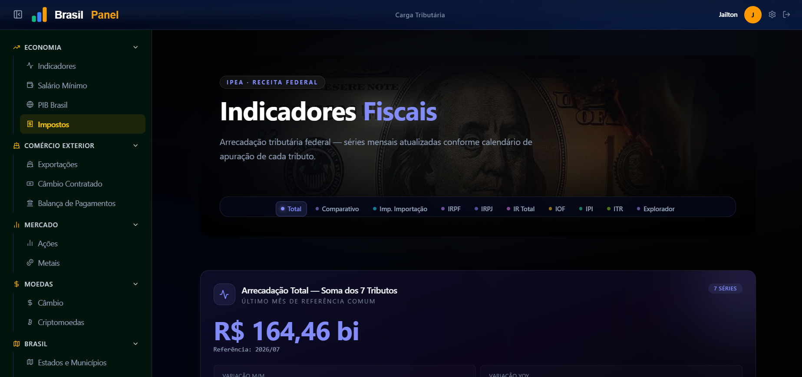
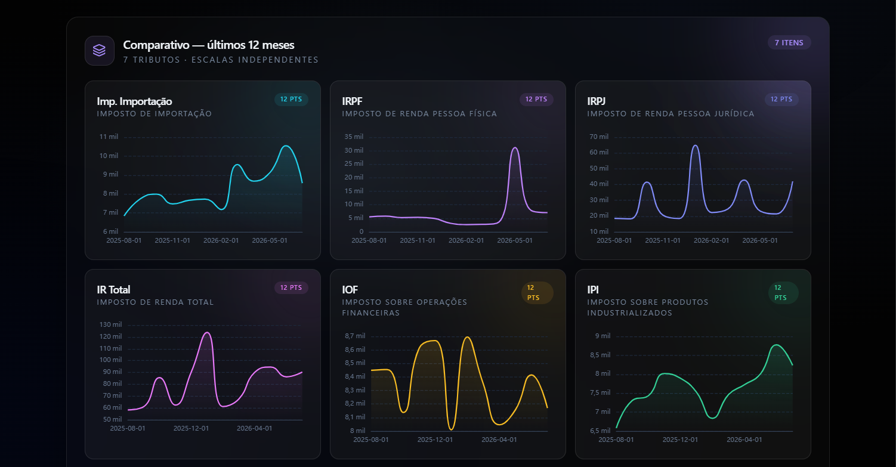
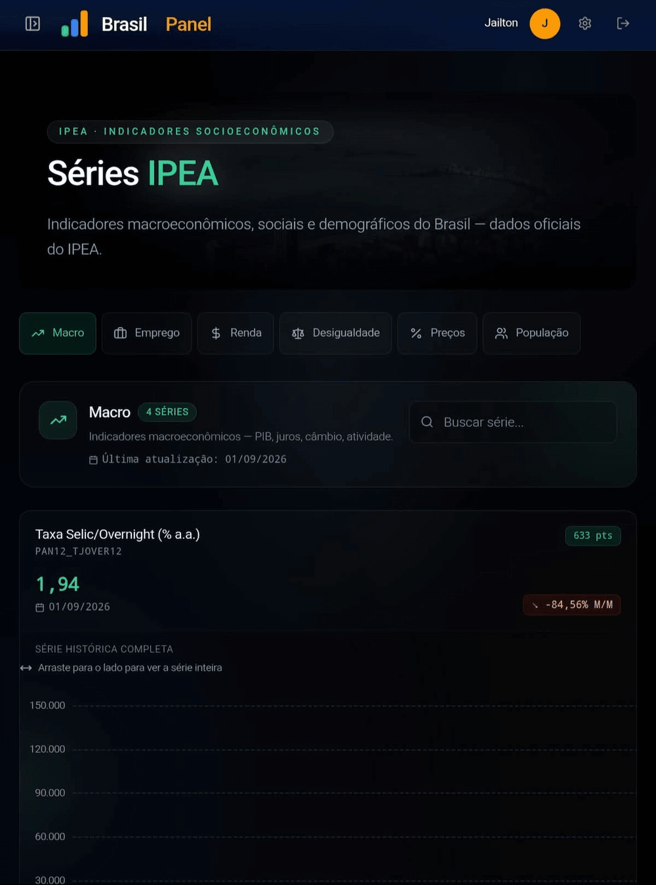
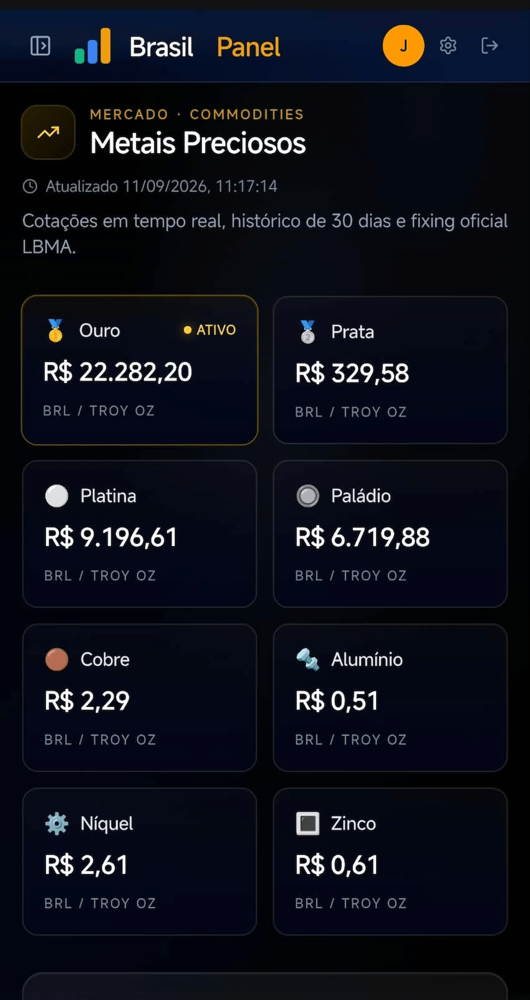
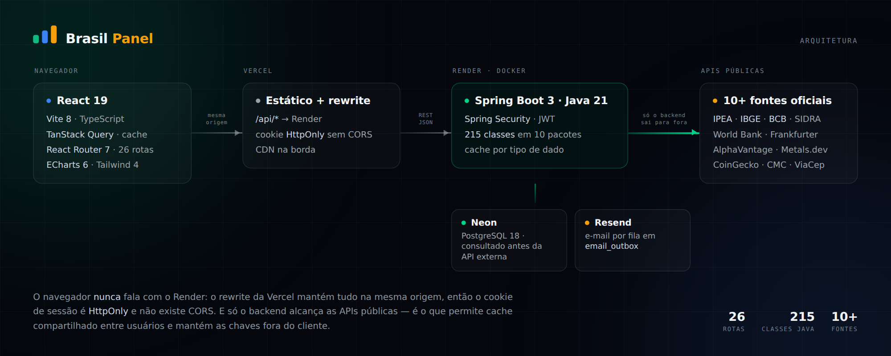
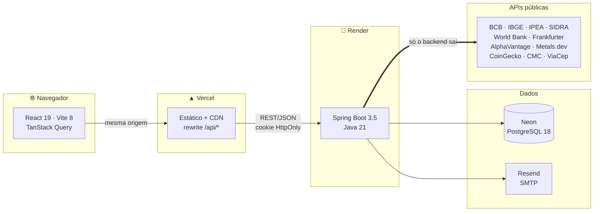
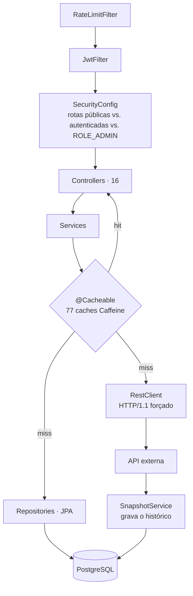
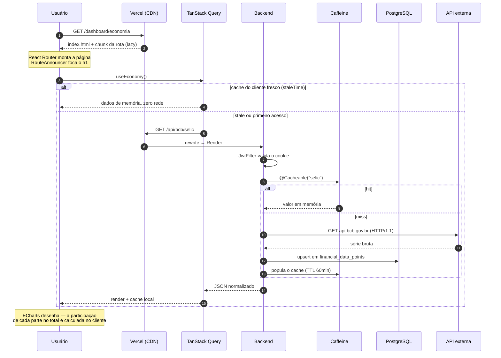

<div align="center">


# 🇧🇷 Brasil Panel

**Painel de dados econômicos e financeiros do Brasil.**  
Indicadores oficiais, cotações ao vivo, séries históricas e dados geográficos reunidos
em uma interface limpa e rápida.

<br/>


<br/>

**96 endpoints · 10+ fontes oficiais · 23 tabelas · 26 rotas no front**

</div>

---

## 📋 Sumário

- [O que é](#-o-que-é)
- [O painel](#-o-painel)
- [Arquitetura](#-arquitetura)
- [O ciclo completo](#-o-ciclo-completo)
- [Stack](#-stack)
- [Fontes de dados](#-fontes-de-dados)
- [Páginas](#-páginas)
- [Cache em duas camadas](#-cache-em-duas-camadas)
- [Estrutura do projeto](#-estrutura-do-projeto)
- [Como executar](#-como-executar)
- [Produção](#-produção)
- [Segurança](#-segurança)
- [Documentação detalhada](#-documentação-detalhada)

---

## 🎯 O que é

O **Brasil Panel** é um monorepo full-stack que agrega dados de mais de dez APIs
públicas — Banco Central, IBGE, IPEA, World Bank, entre outras —, persiste o que vale a
pena guardar em PostgreSQL e exibe tudo em um dashboard com autenticação própria.

Não é um agregador de links: cada série passa pelo backend, que normaliza o formato,
guarda histórico e serve o frontend a partir de um cache dimensionado pela cadência de
cada fonte. É o que permite que uma página com quinze gráficos abra sem estourar a cota
de nenhuma API.

Em produção o frontend está na **Vercel**, o backend roda como container no **Render** e
o banco fica no **Neon** — o passo a passo está em [DEPLOY.md](DEPLOY.md).

---

## 🖼 O painel

<div align="center">



<sub>Painel principal — indicadores do Banco Central, séries do IPEA e cotações</sub>

</div>

<br/>

<div align="center">



<sub>Séries históricas com ECharts — participação de cada parte no total, calculada no cliente</sub>

</div>

<br/>

<table>
<tr>
<td width="50%" align="center">



<sub><b>Tablet</b> — a grade recompõe em duas colunas</sub>

</td>
<td width="50%" align="center">



<sub><b>Mobile</b> — coluna única, menu em overlay</sub>

</td>
</tr>
<tr>
<td width="50%" align="center">


<sub><b>Login</b> — split-screen com painel de marca</sub>

</td>
<td width="50%" align="center">


<sub><b>Landing</b> — a arara é uma composição única, sem camadas de CSS por cima</sub>

</td>
</tr>
</table>

---

## 🏗 Arquitetura



O desenho comunica duas decisões, e as duas são de segurança antes de serem de
performance:

**O navegador nunca fala com o Render.** O `vercel.json` reescreve `/api/*` para o
backend, então, do ponto de vista do navegador, front e API têm a **mesma origem**. Não
existe CORS a configurar e o cookie de sessão pode ser `HttpOnly` + `SameSite=Lax` sem
nenhuma exceção — é o que torna o JWT inacessível ao JavaScript e, portanto, imune a
exfiltração por XSS.

**Só o backend alcança as APIs públicas.** As chaves da Alpha Vantage, da Metals.dev e do
CoinMarketCap nunca chegam ao cliente, e o cache do servidor é **compartilhado entre
todos os usuários** — o segundo visitante do dia não gasta cota nenhuma. Se o front
chamasse as fontes direto, cada aba abriria a própria cota e as chaves estariam no bundle.



### Camadas do backend



O `RestClient` roda com **HTTP/1.1 forçado**: o WAF do BCB rejeita HTTP/2 com `502`.

---

## 🔄 O ciclo completo

Do clique ao pixel, quando um usuário abre `/dashboard/economia`:



Três coisas que esse fluxo esconde e que decidem o comportamento observável:

1. **O primeiro acesso do dia é lento.** O Render Free hiberna após ~15 min ociosa e o
   boot completo do Spring Boot na CPU compartilhada leva **~150 s**. O frontend trata
   isso como estado de carregamento, com timeout compatível — não como erro.
2. **O cache do servidor é o que protege a cota.** O cache do cliente (TanStack Query)
   economiza rede para *aquele* usuário; o do servidor (Caffeine) economiza cota para
   *todos*. São camadas independentes com propósitos diferentes — ver
   [Cache em duas camadas](#-cache-em-duas-camadas).
3. **Nem todo miss vai à API.** No CoinMarketCap, um miss cai no Postgres: só o scheduler
   gasta crédito. É o que permite TTL curto sem estourar a cota.

---

## 🛠 Stack

### Backend

| Tecnologia | Versão | Uso |
|---|---|---|
|  | 21 | Linguagem principal |
|  | 3.5 | Framework base |
|  | 6 | Autenticação JWT |
|  | 3.5 | ORM / repositórios |
|  | 6.6 | Implementação JPA |
|  | — | Versionamento do schema |
|  | 18 | Banco de dados |
|  | 6.3 | Pool de conexões |
|  | — | Cache em memória (77 caches) |
|  | — | Documentação interativa (só em `dev`) |

### Frontend

| Tecnologia | Versão | Uso |
|---|---|---|
|  | 19 | UI |
|  | 6 | Tipagem estática |
|  | 8 | Build (rolldown) |
|  | 4 | Estilização |
|  | 5 | Fetching, cache e estado assíncrono |
|  | 7 | Roteamento SPA (26 rotas, chunks lazy) |
|  | 6 | Gráficos |
|  | 4 | Testes |

**Qualidade.** ESLint com `eslint-plugin-jsx-a11y`, 18 arquivos de teste no front e 48
no backend, e quatro workflows no GitHub Actions (`ci`, `cd`, `ipea-seed`,
`security-scan`). O CI roda as migrations em banco limpo e valida contra as entidades.

---

## 🔌 Fontes de dados

| API | Dados | Persistência | Chave |
|---|---|---|---|
| **BCB** (Banco Central) | CDI, SELIC, IPCA, PTAX, salário mínimo | `financial_data_points` | — pública |
| **IPEA Data** | 45 séries: emprego, renda, desigualdade, macro, preços, população, balança, exportações, impostos, câmbio contratado | — | — pública |
| **IBGE** | Estados e municípios | `ibge_states`, `ibge_cities` | — pública |
| **SIDRA** (IBGE) | PIB por unidade da federação | `pib_estadual_snapshots` | — pública |
| **World Bank** | PIB do Brasil por ano | `pib_snapshots` | — pública |
| **Frankfurter** | Câmbio entre moedas + histórico | — | — pública |
| **Alpha Vantage** | Cotações de ações (PETR4, VALE3, AAPL…) | `stock_snapshots` | ✅ gratuita |
| **Metals Dev** | Ouro, prata, platina, paládio, industriais em BRL | `metal_snapshots`, `lbma_fixings` | ✅ gratuita |
| **CoinGecko** | Top 100 criptos por market cap em BRL | `crypto_snapshots` | — pública |
| **CoinMarketCap** | Listagem, busca e métricas globais | `cmc_crypto_snapshots` | ⚪ opcional |
| **BrasilAPI** | Lista de bancos brasileiros | `banks` | — pública |
| **ViaCep** | Endereço por CEP e busca reversa | — | — pública |

> **Rotação de chaves Alpha Vantage** via `AtomicInteger` — contorna o limite de 25
> requisições por dia por chave.

---

## 🖥 Páginas

```
público
  /                          → landing (Sobre) para quem não está logado
  /sobre                     → landing
  /login-usuario             → login          (split-screen com brand panel)
  /registro-usuario          → cadastro
  /verificar-email           → código de 6 dígitos
  /esqueci-senha             → pedido de recuperação
  /redefinir-senha           → nova senha com código
  /confirmar-admin/login     → segundo fator do admin
  /confirmar-admin/senha     → segundo fator da troca de senha

autenticado
  /dados-perfil              → perfil do usuário
  /dashboard/economia        → CDI · SELIC · IPCA · PTAX
  /dashboard/economia/salario   → salário mínimo
  /dashboard/economia/pib       → PIB — World Bank e SIDRA
  /dashboard/economia/impostos  → 7 tributos + arrecadação total
  /dashboard/mercado/acoes      → cotações — Alpha Vantage
  /dashboard/mercado/metais     → metais — Metals Dev e LBMA
  /dashboard/moedas/cambio      → câmbio — Frankfurter
  /dashboard/moedas/cripto      → criptomoedas — CoinGecko e CMC
  /dashboard/comercio/exportacoes        → composição das exportações
  /dashboard/comercio/cambioComercial    → câmbio contratado
  /dashboard/comercio/balancaPagamentos  → balança de pagamentos
  /dashboard/brasil/ibge        → estados e municípios
  /dashboard/brasil/ipea        → indicadores sociais
  /dashboard/brasil/bancos      → bancos — BrasilAPI
  /dashboard/settings           → conta e segurança

admin
  /dashboard/admin/usuarios  → promover, rebaixar, listar
```

Cada rota é um chunk separado (`React.lazy`), então abrir o painel não baixa o gráfico
de exportações.

### Três modelos de "parte do todo"

Séries econômicas se compõem de maneiras diferentes, e tratar as três como uma só produz
número errado. O front distingue:

| Modelo | Quando | Visual |
|---|---|---|
| `AggregatedTotal` | as partes **somam** o total (7 tributos → arrecadação) | barra empilhada |
| `SharesOfTotal` | cada parte tem série própria e podem se sobrepor | uma barra por parte |
| `WaterfallBreakdown` | soma algébrica, aceita negativo (balança) | cascata |

O cálculo é do cliente (`frontend/src/components/indicators/Helpers.ts`), com
correspondência estrita de mês de referência: parte sem ponto naquele mês entra em
`omitted[]` em vez de virar zero.

---

## ⚡ Cache em duas camadas

As duas existem por motivos diferentes e não se substituem.

### Cliente — TanStack Query

Economiza **rede para aquele usuário**. Os tempos vêm de
`frontend/src/constants/queryTimes.ts`, agrupados pela natureza do dado:

| Tier | `staleTime` | Refetch | Fontes |
|---|---|---|---|
| `STATIC` | 24 h | — | ViaCep · IBGE · bancos |
| `HISTORICAL` | 24 h | — | IPEA · World Bank |
| `DAILY` | 1 h | — | BCB (SELIC, IPCA, CDI, PTAX) |
| `FINANCIAL` | 15 min | 15 min | Alpha Vantage · Metals Dev |
| `MARKET` | 5 min | 5 min | Frankfurter (padrão do `QueryClient`) |
| `REALTIME` | 2 min | 2 min | CoinGecko |

### Servidor — Caffeine

Economiza **cota para todos**. São **77 caches**, cada um com TTL e capacidade próprios,
em seis tiers ajustáveis por perfil em `app.cache.ttl.*`:

| Tier | TTL | Exemplos |
|---|---|---|
| `staticData` | 7 dias | `ibge-states` · `ibge-cities` · `ibge-states-ranking` |
| `daily` | 24 h | as ~50 séries do IPEA · `worldbank-*` · `sidra-pib-estados` · `viacep` |
| `halfDay` | 12 h | `banks` · `metals-history` · `lbma-fixing` · `stock-history` |
| `hourly` | 60 min | `selic` · `bcb-ipca` · `bcb-ptax` · `bcb-cdi` · `metals` · `frank-furter` |
| `intraday` | 15 min | `stocks` |
| `realtime` | 5 min | `crypto-list` · `cmc-*` |

Quatro arquivos em `config/cache/`: `CacheConfig` monta o `CacheManager`, `CacheCatalog`
é o catálogo declarativo, `CacheSpec` é o `record (name, ttl, maximumSize)` com validação
e `CacheTtlProperties` guarda os seis tiers.

> Usa `SimpleCacheManager` de propósito: ele **não** cria caches sob demanda, então um
> nome errado em `@Cacheable` falha na primeira chamada em vez de criar silenciosamente
> um cache sem expiração. Um teste varre o classpath e garante que todo nome usado em
> `@Cacheable` existe no catálogo.

---

## 📁 Estrutura do projeto

```
brasil_panel/
│
├── docs/
│   ├── API.md                       # referência dos 96 endpoints
│   ├── BANCO.md                     # schema, migrations, fila de e-mail
│   └── img/                         # imagens do README
│
├── frontend/                        # React 19 + TypeScript + Vite 8
│   ├── vercel.json                  # rewrite /api/* + CSP e headers de segurança
│   └── src/
│       ├── api/client · services/   # axios + um service por domínio
│       ├── assets/                  # SVGs e imagens com hash no bundle
│       ├── components/
│       │   ├── brand/               # BrandLogo (variantes SVG inline)
│       │   ├── forms/               # FormField · SubmitButton · AuthBrandPanel
│       │   └── indicators/          # cartões, gráficos e os três modelos de composição
│       ├── constants/               # specs por domínio + queryTimes
│       ├── hooks/                   # um hook por fonte (useEconomy, useIpea, …)
│       ├── layouts/                 # DashboardLayout · OnboardingLayout
│       ├── lib/                     # auth · errors · query · validation
│       ├── pages/
│       │   ├── About/               # landing
│       │   ├── auth/ · onboarding/
│       │   ├── dashboard/           # economia · mercado · moedas · comercio · brasil
│       │   └── errors/              # 404 (vaga-lume)
│       └── types/                   # tipos por domínio
│
└── backend/backend/                 # Spring Boot 3.5 · Java 21 · 215 classes
    ├── Dockerfile                   # multi-estágio (Maven → JRE 21, usuário não-root)
    └── src/main/
        ├── java/com/brasilpanel/backend/
        │   ├── config/
        │   │   ├── cache/           # CacheConfig · CacheCatalog · CacheSpec · CacheTtlProperties
        │   │   ├── cors/ · jwt/     # CorsConfig · JwtFilter · JwtService
        │   │   ├── ratelimit/       # ApiRateLimiter · RateLimitFilter
        │   │   ├── scheduler/       # EmailOutboxScheduler e demais rotinas
        │   │   ├── seed/            # AdminSeeder · FinancialSeriesSeeder · StaticDataSeeder
        │   │   ├── securityConfig/  # SecurityConfig
        │   │   └── webConfig/       # RestClient (HTTP/1.1 forçado)
        │   ├── controller/          # api/ · auth/ · profile/ — 16 controllers
        │   ├── dto/ · mappers/      # records de transferência
        │   ├── exception/           # GlobalExceptionHandler
        │   ├── model/ · repository/ # entidades e repositórios JPA
        │   ├── service/             # api/ · auth/ · email/ · financial/ · static_data/
        │   └── validators/          # validadores por domínio + @ValidCep
        └── resources/db/migration/  # V1 … V8 — o schema é versionado aqui
```

---

## 🚀 Como executar

### Pré-requisitos
- Java 21+ · Node.js 20+ · Docker · Maven 3.9+ (ou o `./mvnw` incluso)

### 1. Banco de dados

```bash
cd backend/backend
docker compose up -d
```

Só isso. O `compose.yaml` já cria o banco `brasil_panel`, o usuário e as permissões — não
é preciso rodar nenhum `psql` manualmente.

| | Valor |
|---|---|
| Banco / usuário / senha | `brasil_panel` |
| Porta | `5432` |

> Credenciais de desenvolvimento local, propositalmente simples: o container não é
> exposto para fora da máquina. Em produção tudo vem de variáveis de ambiente — ver
> [DEPLOY.md](DEPLOY.md).

### 2. `application-dev.yml`

Criar em `backend/backend/src/main/resources/application-dev.yml` (**não commitado**):

```yaml
# Obrigatório: não há valor padrão versionado para o secret.
# Gere com um RNG criptográfico (mínimo 32 bytes):
#   $b = New-Object byte[] 48
#   [System.Security.Cryptography.RandomNumberGenerator]::Create().GetBytes($b)
#   [Convert]::ToBase64String($b)
jwt:
  secret: 'SEU_SECRET_LOCAL_AQUI'

spring:
  datasource:
    url: jdbc:postgresql://localhost:5432/brasil_panel
    driver-class-name: org.postgresql.Driver
    username: brasil_panel      # precisa bater com o compose.yaml
    password: brasil_panel
  jpa:
    hibernate:
      ddl-auto: validate        # o schema vem do Flyway, não do Hibernate
    show-sql: true
    open-in-view: false
    properties:
      hibernate:
        format_sql: true
  cache:
    type: caffeine

alpha-vantage:
  keys: CHAVE1,CHAVE2,CHAVE3,CHAVE4   # https://www.alphavantage.co

metals:
  api-key: SUA_METALS_KEY              # https://metals.dev
```

### 3. Backend

```bash
cd backend/backend
./mvnw spring-boot:run -Dspring-boot.run.profiles=dev
```

Na primeira inicialização o **Flyway** cria todo o schema e os seeders rodam em seguida:

- ✅ 9 séries financeiras do BCB em `financial_series`
- ✅ ~260 bancos da BrasilAPI em `banks`
- ✅ 27 estados do IBGE em `ibge_states`
- ✅ admin criado — **apenas se `ADMIN_PASSWORD` estiver definida**; sem ela o seeder
  registra um aviso e não cria nada

> 📖 Swagger UI: `http://localhost:8080/swagger-ui.html`

### 4. Frontend

```bash
cd frontend
npm install
npm run dev
```

> 🌐 App: `http://localhost:5173`

### Testes

```bash
cd frontend && npm test          # Vitest
cd backend/backend && ./mvnw test
```

---

## 🌐 Produção

| Camada | Onde | Observação |
|---|---|---|
| Frontend | **Vercel** | Estático na CDN; reescreve `/api/*` para o backend |
| Backend | **Render** — container Docker | Free hiberna após ~15 min sem requisição |
| Banco | **Neon** — PostgreSQL 18.6 | Serverless; suspende e acorda em ~1 s |
| E-mail | **Resend** — SMTP, domínio verificado | Fila assíncrona via `email_outbox` |

```
API     https://brasil-panel-utilities-api.onrender.com
Health  /actuator/health
```

O Render não tem runtime Java nativo, por isso o backend é publicado como imagem —
`backend/backend/Dockerfile`, build multi-estágio (Maven compila, JRE 21 executa,
processo roda como usuário não-root).

**Duas características do plano gratuito que afetam o comportamento observável:**

- **Cold start de ~150 segundos.** A instância hiberna após ~15 min ociosa, e o boot
  completo do Spring Boot na CPU compartilhada do Free leva esse tempo. O primeiro acesso
  depois da hibernação é lento — o frontend precisa tolerar isso, com timeout compatível
  e um estado de carregamento, em vez de tratar como erro.
- **SMTP na porta 587 é bloqueado na saída.** Por isso `MAIL_PORT=2587`, a porta
  alternativa do Resend.

> 📘 Runbook completo — variáveis de ambiente, armadilhas de boot, verificação pós-deploy
> e semântica de rollback com migrations: **[DEPLOY.md](DEPLOY.md)**

---

## 🔒 Segurança

- **JWT em cookie `HttpOnly`** — inacessível ao JavaScript. `SameSite=Lax` cobre CSRF; a
  flag `Secure` é controlada por `COOKIE_SECURE` (`true` em produção)
- `JwtFilter` lê **apenas** o cookie. O fallback para `Authorization: Bearer` foi
  removido: era um segundo canal para a mesma credencial, e que vaza com facilidade em log
  de proxy e de CDN
- O token declara `aud` (`brasil-panel-api`) e o `JwtService` o exige na validação
- **Logout revoga o token de verdade** — denylist de `jti` em `revoked_token` (`V8`), com
  expurgo diário. Sair num aparelho não desconecta os outros
- **Trocar a senha invalida todas as sessões** — `users.password_changed_at` (`V5`) faz o
  `JwtService` recusar tokens emitidos antes da troca
- **Segundo fator do admin** por e-mail para login e troca de senha (`V6`/`V7`). A senha,
  sozinha, não dá acesso
- Senhas com **BCrypt**
- **Rate limiting** no login: 5 tentativas por e-mail a cada 15 minutos, depois `429`. O
  contador é por instância (Caffeine em memória) — com múltiplas réplicas o limite efetivo
  é multiplicado
- **Rate limit de e-mail**: teto por cliente em `/auth/register` e `/auth/resend-code`,
  mais um teto global diário dimensionado abaixo da cota do provedor
- **`JWT_SECRET` é obrigatório**: sem a variável a aplicação não sobe. Não existe valor
  padrão versionado — um default no repositório seria uma chave pública
- **CSP e headers de segurança** no `vercel.json`: `script-src 'self'`, `frame-ancestors
  'none'`, `X-Content-Type-Options`, `Referrer-Policy`, `Permissions-Policy` e HSTS
- **Swagger só no perfil `dev`**
- **O health check não depende de serviço externo.** O `MailHealthIndicator` é desligado
  de propósito: ele abre uma conexão SMTP a cada checagem, e como a plataforma usa
  `/actuator/health` para decidir se a instância está viva, um provedor de e-mail fora do
  ar derrubava a API inteira
- **O schema é versionado pelo Flyway.** Os três perfis usam `ddl-auto: validate`; alterar
  entidade exige a migration no mesmo commit
- `application-dev.yml` está no `.gitignore` — **nunca commitado**;
  `application-prod.yml` usa exclusivamente variáveis de ambiente

### Acessibilidade

- Skip link como primeiro alvo do Tab; `<main id="conteudo">`
- `RouteAnnouncer` foca o `<h1>` da nova rota e anuncia em `aria-live="polite"`
- Sidebar em overlay fecha no `Escape`; backdrop marcado `aria-hidden`
- Contraste do texto terciário elevado a **5,03:1** (`--color-fg-dim`), acima do mínimo
  4,5:1 da WCAG 2.2 AA
- `eslint-plugin-jsx-a11y` no lint, com a ressalva de que ele não vê contraste, ordem de
  foco nem anúncio de rota

---

## 📚 Documentação detalhada

| Documento | O que tem |
|---|---|
| **[docs/API.md](docs/API.md)** | Os 96 endpoints por grupo, o fluxo de autenticação e a invalidação de sessão |
| **[docs/BANCO.md](docs/BANCO.md)** | As 23 tabelas, as 8 migrations com o porquê de cada uma, persistência e fila de e-mail |
| **[DEPLOY.md](DEPLOY.md)** | Runbook de publicação: variáveis, armadilhas de boot, verificação e rollback |
| **[docs/img/LEIA-ME.md](docs/img/LEIA-ME.md)** | Onde vive cada tipo de imagem do projeto |

---

<div align="center">

Feito com ☕ e 🇧🇷 por **Jailton Matos**


</div>
