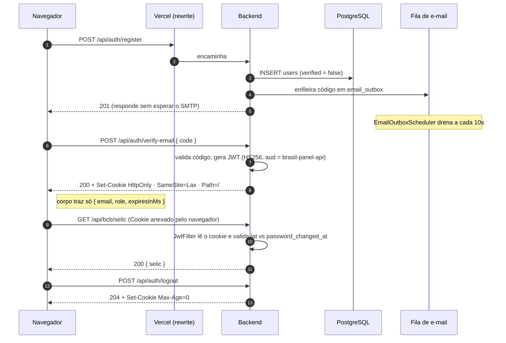

# 📡 API — Referência de Endpoints

> Documento de referência do backend. Para a visão geral do projeto, volte ao
> [README](../README.md); para o schema, veja [BANCO.md](BANCO.md).

São **96 endpoints** em 16 controllers. A documentação interativa (Swagger UI) fica em
`http://localhost:8080/swagger-ui.html` — **só no perfil `dev`**. Em produção o Swagger
é desabilitado e as únicas rotas que respondem são `/api/**` e `/actuator/health`.
`GET /` devolve `404` por design: este serviço é a API, não o site.

Base em produção: `https://brasil-panel-utilities-api.onrender.com`

---

## Sumário

- [Autenticação](#-autenticação--apiauth)
- [Perfil](#-perfil--apiprofile)
- [Administração](#️-administração--apiadmin)
- [Banco Central](#-banco-central--apibcb)
- [IPEA](#-ipea--apiipea) — o maior grupo, 45 rotas
- [Ações](#-ações--apiquote)
- [Metais](#-metais--apimetals)
- [Criptomoedas](#-criptomoedas)
- [Câmbio](#-câmbio--apifrankfurter)
- [IBGE e SIDRA](#️-ibge--apiibge)
- [World Bank](#-world-bank--apiworldbank)
- [Bancos e CEP](#️-bancos--apibanks)

---

## 🔐 Autenticação — `/api/auth`

| Método | Rota | Descrição |
|---|---|---|
| `POST` | `/api/auth/register` | Cria o usuário e envia código de verificação por e-mail |
| `POST` | `/api/auth/verify-email` | Valida o código de 6 dígitos e abre a sessão |
| `POST` | `/api/auth/resend-code` | Reenvia o código de verificação |
| `POST` | `/api/auth/login` | Autentica e devolve o cookie de sessão — para **admin**, responde `202` e nenhum cookie |
| `POST` | `/api/auth/admin/confirm-login` | Conclui o login de admin com o código recebido por e-mail |
| `POST` | `/api/auth/logout` | Encerra a sessão (apaga o cookie) |
| `PATCH` | `/api/auth/update-name` | Altera o nome — requer sessão |
| `PATCH` | `/api/auth/update-password` | Altera a senha — requer sessão; para **admin**, responde `202` e a troca fica retida |
| `POST` | `/api/auth/admin/confirm-password` | Aplica a troca de senha do admin com o código recebido por e-mail |
| `POST` | `/api/auth/forgot-password` | Pede o código de recuperação — resposta idêntica exista ou não a conta |
| `POST` | `/api/auth/reset-password` | Redefine a senha com o código e derruba as sessões abertas |
| `DELETE` | `/api/auth/delete-account` | Exclui a conta — requer sessão |

Login e verificação respondem com `Set-Cookie` (`HttpOnly`). O corpo traz apenas
`email`, `role` e `expiresInMs` — **o JWT nunca aparece na resposta**. Após 5 tentativas
malsucedidas para o mesmo e-mail, a rota devolve `429` por 15 minutos.

Trocar a senha **invalida todas as sessões abertas**, inclusive em outros dispositivos
— ver [Fluxo de autenticação](#fluxo-de-autenticação) abaixo.

> **Segundo fator do admin.** Login e troca de senha da conta ADMIN exigem um código de
> 6 dígitos enviado ao endereço de `ADMIN_SECURITY_EMAIL`. A senha, sozinha, não dá
> acesso: o `202` não emite cookie e a troca não toca em `users.password` até a
> confirmação. `ADMIN_2FA_ENABLED=false` é a válvula de escape se o e-mail falhar — ver
> armadilha #8 no [DEPLOY.md](../DEPLOY.md).

## 👤 Perfil — `/api/profile`

| Método | Rota | Descrição |
|---|---|---|
| `GET` | `/api/profile/options` | Catálogos de preenchimento (áreas, níveis, profissões) |
| `GET` | `/api/profile/me` | Perfil do usuário autenticado |
| `PUT` | `/api/profile/me` | Atualiza o perfil |

## 🛡️ Administração — `/api/admin` · requer `ROLE_ADMIN`

| Método | Rota | Descrição |
|---|---|---|
| `GET` | `/api/admin/users` | Lista os usuários |
| `PUT` | `/api/admin/users/{id}/promote` | Promove a ADMIN |
| `PUT` | `/api/admin/users/{id}/demote` | Rebaixa a USER |
| `POST` | `/api/admin/ipea/refresh` | Recarrega as séries do IPEA |

> Um admin não consegue revogar o próprio acesso.

---

## 🏦 Banco Central — `/api/bcb`

| Método | Rota | Descrição |
|---|---|---|
| `GET` | `/api/bcb/cdi` | CDI diário + taxa anualizada (252 d.u.) |
| `GET` | `/api/bcb/selic` | SELIC diária, mensal, anual e composta 12 meses |
| `GET` | `/api/bcb/selic/history` | Histórico SELIC — últimos 12 meses |
| `GET` | `/api/bcb/ipca` | IPCA mensal, acumulado ano, soma e composição 12 meses |
| `GET` | `/api/bcb/dollar/ptax` | Dólar PTAX (taxa oficial do Banco Central) |
| `GET` | `/api/bcb/minimum-wage?intervalo=N` | Salário mínimo (N meses, padrão 1) |
| `GET` | `/api/bcb/minimum-wage/history` | Histórico salário mínimo (20 meses) |

---

## 📊 IPEA — `/api/ipea`

O IPEA Data é a fonte mais explorada do projeto: **45 rotas** organizadas em seis
famílias. Todas devolvem série temporal (`{ data, valor }[]`) com o mesmo formato, o que
permite que o frontend use um único componente de gráfico para todas.

### Indicadores sociais e macro

| Rota | Descrição |
|---|---|
| `GET /api/ipea/emprego` | Taxa de desocupação e nível de ocupação — PNAD Contínua mensal |
| `GET /api/ipea/renda` | Salário mínimo real, salário mínimo PPC e renda domiciliar per capita |
| `GET /api/ipea/desigualdade` | Coeficiente de Gini e taxa de pobreza anual |
| `GET /api/ipea/macro` | PIB, investimento, desemprego FMI, Selic, reservas e arrecadação federal |
| `GET /api/ipea/precos` | INPC e IGP-M — índices de inflação mensais |
| `GET /api/ipea/populacao` | População total mensal e projeções até 2070 por sexo |
| `GET /api/ipea/pib/mensal` | PIB mensal |

### Balança de pagamentos — `/api/ipea/balanca/*`

| Rota | Descrição |
|---|---|
| `.../ativos-reservas` | Ativos de reserva |
| `.../transacoes-correntes` | Transações correntes (US$ milhões) |
| `.../transacoes-correntes-pib` | Transações correntes (% do PIB) |
| `.../comercial` | Balança comercial |
| `.../servicos` | Serviços |
| `.../servicos-despesas` | Serviços — despesas |
| `.../renda-primaria` | Renda primária |
| `.../conta-capital` | Conta capital |
| `.../conta-financeira` | Conta financeira |
| `.../investimento-direto` | Investimento direto |
| `.../investimento-direto-ingressos` | Investimento direto no país — ingressos |
| `.../investimento-carteira` | Investimento em carteira |

### Exportações — `/api/ipea/exportacoes/*`

| Rota | Descrição |
|---|---|
| `.../total` | Exportações totais (FOB) |
| `.../quantum` | Índice de quantum das exportações |
| `.../produtos-basicos` | Exportações de produtos básicos (FOB) |
| `.../bens-consumo` | Exportações de bens de consumo (FOB) |
| `.../valor-bens-intermediarios` | Valor FOB — bens intermediários |
| `.../valor-combustiveis` | Valor FOB — combustíveis |
| `.../quantum-agricultura-pecuaria` | Índice de quantum — agricultura e pecuária |
| `.../quantum-bens-intermediarios` | Índice de quantum — bens intermediários |
| `.../precos-bens-capital` | Índice de preços — bens de capital |
| `.../precos-bens-duraveis` | Índice de preços — bens duráveis |
| `.../precos-bens-nao-duraveis` | Índice de preços — bens não duráveis |

### Impostos — `/api/ipea/impostos/*`

| Rota | Descrição |
|---|---|
| `.../importacao` | Imposto sobre a importação (II) |
| `.../irpf` | Imposto de renda pessoa física |
| `.../irpj` | Imposto de renda pessoa jurídica |
| `.../ir-total` | Imposto de renda — total |
| `.../iof` | Imposto sobre operações financeiras |
| `.../ipi` | Imposto sobre produtos industrializados |
| `.../itr` | Imposto sobre a propriedade territorial rural |

> A página de impostos soma esses sete tributos em "Arrecadação Total" e calcula a
> participação de cada um no todo — o cálculo é do frontend, não do backend
> (`computeAggregatedTotal` em `frontend/src/components/indicators/Helpers.ts`).

### Câmbio contratado — `/api/ipea/cambio/*`

| Rota | Descrição |
|---|---|
| `.../comercial` | Câmbio contratado — comercial |
| `.../comercial/exportacao` | Comercial (exportação) |
| `.../comercial/importacao` | Comercial (importação) |
| `.../comercial-financeiro` | Comercial e financeiro |
| `.../financeiro` | Financeiro (total) |
| `.../financeiro/compra` | Financeiro (compra) |
| `.../financeiro/venda` | Financeiro (venda) |

> Hierarquia importa aqui: `comercial` e `financeiro` são **totais**, não parcelas.
> Somá-los junto com as subséries contaria o mesmo valor duas vezes — a marcação
> `isAggregate` em `CambioSpecs.ts` existe para impedir isso, e há teste travando a
> hierarquia.

### Mercado

| Rota | Descrição |
|---|---|
| `GET /api/ipea/mercado/ibovespa` | Ibovespa — fechamento |

---

## 📈 Ações — `/api/quote`

| Método | Rota | Descrição |
|---|---|---|
| `GET` | `/api/quote/{symbol}` | Cotação — ex: `PETR4.SA`, `VALE3.SA`, `AAPL` |
| `GET` | `/api/quote/{symbol}/history` | Série histórica diária do papel |

## 🥇 Metais — `/api/metals`

| Método | Rota | Descrição |
|---|---|---|
| `GET` | `/api/metals` | Ouro, prata, platina, paládio, cobre, alumínio, níquel, zinco em BRL/toz |
| `GET` | `/api/metals/history` | Série histórica dos metais |
| `GET` | `/api/metals/lbma` | Fixing LBMA (publicado 2x por dia útil) |

## ₿ Criptomoedas

### CoinGecko — `/api/coingecko`

| Método | Rota | Descrição |
|---|---|---|
| `GET` | `/api/coingecko` | Top 100 criptomoedas por market cap em BRL |
| `GET` | `/api/coingecko/{name}` | Preço de cripto específica em BRL — ex: `bitcoin` |

### CoinMarketCap — `/api/coinmarketcap`

| Método | Rota | Descrição |
|---|---|---|
| `GET` | `/api/coinmarketcap` | Listagem por market cap (top 100) |
| `GET` | `/api/coinmarketcap/global` | Métricas globais do mercado |
| `GET` | `/api/coinmarketcap/{term}` | Busca por símbolo ou nome |

> Fonte opcional: sem `CMC_API_KEY` ela fica desligada e o painel roda só com o
> CoinGecko — de propósito, para a aplicação subir sem a chave.

## 💱 Câmbio — `/api/frankfurter`

| Método | Rota | Descrição |
|---|---|---|
| `GET` | `/api/frankfurter?from=USD&to=BRL&amount=1` | Taxa de câmbio atual entre duas moedas |
| `GET` | `/api/frankfurter/history?from=&to=&startDate=&endDate=` | Histórico por período |
| `GET` | `/api/frankfurter/last-30-days?from=&to=` | Histórico dos últimos 30 dias |
| `GET` | `/api/frankfurter/currencies` | Moedas suportadas |

## 🗺️ IBGE — `/api/ibge`

| Método | Rota | Descrição |
|---|---|---|
| `GET` | `/api/ibge` | Todos os estados com região |
| `GET` | `/api/ibge/states/ranking` | Ranking de municípios por estado |
| `GET` | `/api/ibge/states/{state}/cities` | Municípios por estado (sigla ou ID IBGE) |
| `GET` | `/api/ibge/states/{state}/cities?filtro=` | Municípios filtrados por nome |

## 📉 SIDRA — `/api/sidra`

| Método | Rota | Descrição |
|---|---|---|
| `GET` | `/api/sidra/pib-estados` | PIB por unidade da federação |

## 🌍 World Bank — `/api/worldbank`

| Método | Rota | Descrição |
|---|---|---|
| `GET` | `/api/worldbank` | PIB do Brasil mais recente |
| `GET` | `/api/worldbank/series` | Série histórica completa do PIB |
| `GET` | `/api/worldbank/{year}` | PIB do Brasil por ano |

## 🏛️ Bancos — `/api/banks`

| Método | Rota | Descrição |
|---|---|---|
| `GET` | `/api/banks` | Lista de todos os bancos (código + nome) |
| `GET` | `/api/banks/{code}` | Banco pelo código COMPE |

## 📍 CEP — `/api/viacep`

| Método | Rota | Descrição |
|---|---|---|
| `GET` | `/api/viacep/{cep}` | Endereço completo por CEP |
| `GET` | `/api/viacep/busca?uf=&cidade=&logradouro=` | Busca reversa por logradouro |

---

## Fluxo de autenticação

O JWT vive **exclusivamente num cookie `HttpOnly`** — inacessível ao JavaScript e,
portanto, imune a exfiltração por XSS.

**Estado no cliente.** Como o token não pode ser lido, o frontend guarda em
`localStorage` apenas um *hint* de sessão — `{ email, role, exp }`. Ele não autentica
nada: serve só para decidir o que renderizar e manter as funções de guarda síncronas.
Toda autorização real acontece no servidor.

O cookie é a **única** via de autenticação. O header `Authorization: Bearer` era aceito
como segundo canal e deixou de ser: header de requisição aparece em log de proxy, de CDN
e de ferramenta de diagnóstico, onde um cookie `HttpOnly` não costuma parar. Nenhum
cliente dependia dele — o projeto não declara `SecurityScheme` e o Swagger vem desligado
por padrão.

### Invalidação de sessão ao trocar a senha

JWT é stateless — não há store de sessão para limpar, então o token anterior seguiria
válido até expirar, mesmo depois de a vítima trocar a senha justamente para expulsar
quem invadiu.

`users.password_changed_at` resolve isso: o `JwtService` recusa todo token cujo `iat`
seja anterior a esse instante. **Uma coluna substitui o store de sessão que o JWT não
tem.** A coluna é anulável de propósito — `NULL` significa "senha nunca trocada", e aí
não há nada a invalidar.

A comparação trunca para segundos, porque o `iat` do JWT tem precisão de segundo (é o que
a especificação define) e o timestamp do banco tem microssegundos. Sem truncar, o token
emitido logo **depois** da troca pareceria anterior a ela, e o usuário cairia para fora
ao logar em seguida. O preço é uma janela de um segundo, documentada no javadoc e coberta
por teste.

### Segundo fator e revogação

As migrations `V6` (`admin_challenge`), `V7` (auth challenge) e `V8` (`revoked_token`)
sustentam o 2FA do admin e a revogação explícita de token — ver
[BANCO.md](BANCO.md#migrations).
