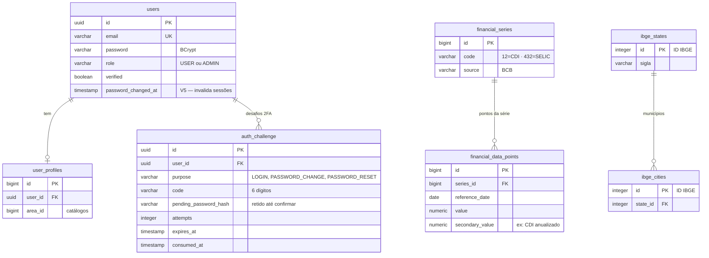
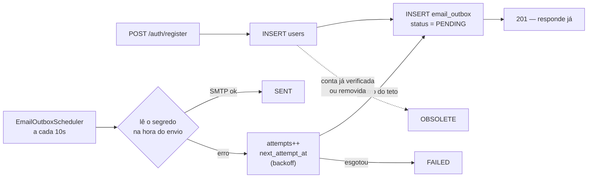

# 🗄 Banco de Dados

> Schema, migrations e estratégia de persistência. Para os endpoints, veja
> [API.md](API.md); para a visão geral, o [README](../README.md).

**23 tabelas**, todas criadas pelo **Flyway** a partir de
`backend/backend/src/main/resources/db/migration/`. Os três perfis rodam com
`ddl-auto: validate` — o Hibernate nunca altera schema em lugar nenhum.

- **dev** — PostgreSQL 18 em container Docker (`compose.yaml`)
- **prod** — Neon, PostgreSQL 18.6 serverless

---

## Mapa das tabelas



As demais tabelas não têm chave estrangeira — são snapshots e catálogos independentes:

```
stock_snapshots               metal_snapshots              crypto_snapshots
───────────────               ───────────────              ────────────────
id (PK)                       id (PK)                      id (PK)
symbol                        reference_ts (unique)        coin_id
trading_day                   currency                     symbol / name
open / high / low / price     gold / silver                image_url
previous_close                platinum / palladium         current_price
change / change_percent       copper / aluminum            market_cap
volume                        nickel / zinc                price_change_24h
fetched_at                    fetched_at                   currency / fetched_at

banks                         email_outbox                 revoked_token
─────                         ────────────                 ─────────────
id (PK)                       id (UUID, PK)                jti (PK)
code (unique)                 recipient / email_type       expires_at
name / full_name              status / attempts            revoked_at
ispb / synced_at              next_attempt_at
                              reference_id  ← V6
                              last_error
                              created_at / completed_at

knowledge_areas · knowledge_subareas · education_levels · profession_levels
──────────────────────────────────────────────────────────────────────────
Catálogos do perfil — populados por migration, servidos em /api/profile/options

cmc_crypto_snapshots · cmc_credit_usage · lbma_fixings
metal_history · pib_snapshots · pib_estadual_snapshots
─────────────────────────────────────────────────────
Séries e snapshots das fontes adicionais
```

---

## Migrations

| Migration | O que faz |
|---|---|
| `V1__baseline.sql` | Schema inicial — 15 tabelas e 17 índices |
| `V2__bank_ispb.sql` | Coluna `ispb` em `banks` |
| `V3__user_profile.sql` | `user_profiles` + os quatro catálogos |
| `V4__email_outbox.sql` | Fila de e-mail com índices de drenagem |
| `V5__user_password_changed_at.sql` | `users.password_changed_at` — invalida sessões na troca de senha |
| `V6__admin_two_factor.sql` | `admin_challenge` + `email_outbox.reference_id` — segundo fator do admin |
| `V7__auth_challenge.sql` | Renomeia para `auth_challenge` — o mesmo mecanismo serve à recuperação de senha |
| `V8__revoked_token.sql` | Denylist de `jti` — faz o logout valer de verdade |

Alterar entidade exige a migration no **mesmo commit**; o CI roda as migrations em banco
limpo e valida contra as entidades, então o desencontro aparece no pull request e não no
deploy.

### Três decisões que valem explicação

**V6 — tabela própria em vez de colunas em `users`.** A troca de senha do admin precisa
guardar a senha nova *pendente* até a confirmação chegar, e um desafio tem ciclo de vida
próprio (expira, é consumido, acumula tentativas). Enfiar isso em `users` misturaria com
`verification_code`, que é do fluxo de cadastro — dois códigos no mesmo campo, um
sobrescrevendo o outro.

**V7 — renomear em vez de duplicar.** A recuperação de senha precisa exatamente do mesmo
mecanismo do 2FA do admin. Duplicar a tabela duplicaria a parte delicada (comparação em
tempo constante, queimar o desafio no limite de tentativas, consumir de uma vez só) em
duas cópias livres para divergir. Só o nome muda; `purpose` passa a distinguir também
`PASSWORD_RESET`.

**V8 — denylist em tabela, não em memória.** Uma denylist em memória se esvazia a cada
restart, e no Render isso acontece em todo deploy e em todo despertar após ociosidade.
Cada restart ressuscitaria os tokens revogados ainda dentro da validade. `V5` já derruba
*todas* as sessões na troca de senha — certo para troca de senha, errado para logout:
sair num aparelho não deve desconectar os outros. Por isso a granularidade aqui é o token
individual, pelo `jti`.

---

## Estratégia de persistência

| Tabela | Quando persiste | Deduplicação |
|---|---|---|
| `financial_data_points` | A cada fetch BCB (CDI, PTAX, Salário) | `series_id + reference_date` |
| `stock_snapshots` | A cada cotação Alpha Vantage | `symbol + trading_day` |
| `metal_snapshots` | A cada fetch Metals Dev | `reference_ts` (único por horário) |
| `crypto_snapshots` | A cada fetch CoinGecko (100 registros) | Histórico completo sem dedup |
| `cmc_crypto_snapshots` | Pelo scheduler, nunca pela requisição | — |
| `banks` | Startup — se tabela vazia | Idempotente por `code` |
| `ibge_states` | Startup — se tabela vazia | Idempotente por `id` IBGE |
| `ibge_cities` | Primeira consulta por estado (lazy) | Idempotente por estado |
| `email_outbox` | No cadastro/reenvio, antes de responder | — (uma linha por envio) |
| `revoked_token` | No logout | PK é o próprio `jti` |

**Lazy seeding de municípios.** Carregar os ~5.570 municípios no startup significaria 27
chamadas ao IBGE antes de a aplicação servir a primeira requisição. Carrega-se por estado,
sob demanda, e a partir daí a tabela responde.

**O CoinMarketCap nunca é chamado pela requisição.** Um miss de cache cai no Postgres, não
na API — só o scheduler gasta crédito. É o que permite manter TTL curto sem estourar a
cota.

---

## Fila de e-mail

O envio **não acontece na thread da requisição**. O cadastro grava uma linha em
`email_outbox` e responde na hora; o `EmailOutboxScheduler` drena a cada 10 segundos, com
retry e backoff exponencial. Falha de SMTP não derruba o cadastro — a entrada fica
`PENDING` e é retentada.



| Status | Significado |
|---|---|
| `PENDING` | aguardando envio, ou a próxima tentativa após falha |
| `SENT` | entregue ao servidor SMTP sem erro |
| `FAILED` | esgotou as tentativas; fica no banco para diagnóstico |
| `OBSOLETE` | descartado — a conta já se verificou ou foi removida no meio do caminho |

O outbox guarda a **intenção** de enviar e lê o segredo só na hora do envio — o código de
verificação nunca fica em repouso na fila. Para o desafio de 2FA isso não bastava (o
código vai para o endereço de segurança do dono, que pode não ser o e-mail da conta), daí
a coluna `reference_id` da `V6`, que diz de qual desafio ler o código.

Diagnóstico é uma consulta:

```sql
select status, count(*) from email_outbox group by status;
```
